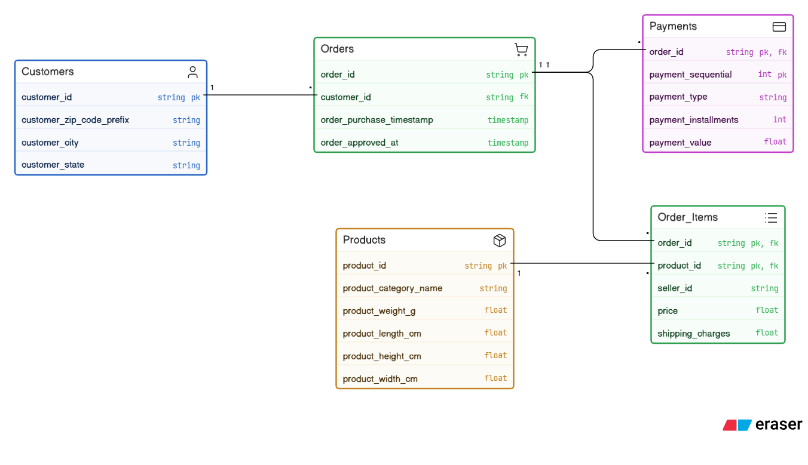
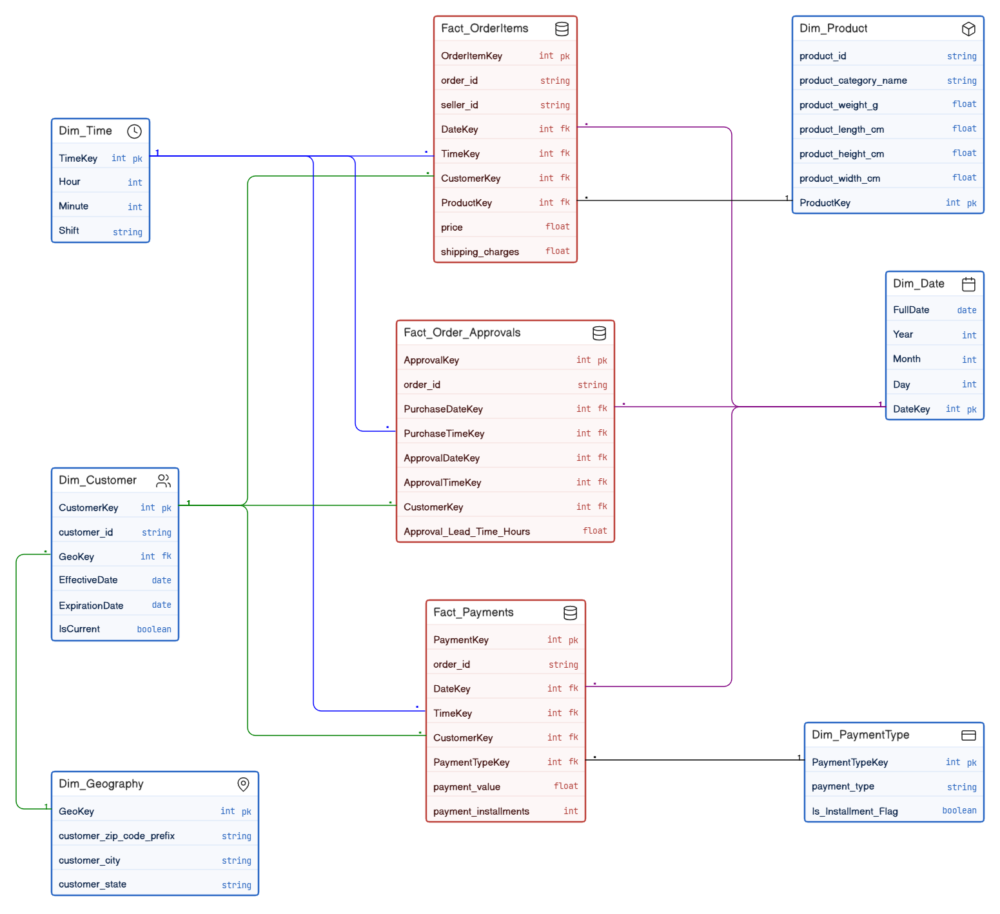

# 🛒 E-Commerce & Supply Chain Data Warehouse 

## 📌 Project Overview
This project involves designing and implementing an enterprise Data Warehouse (DWH) for an E-commerce Order and Supply Chain system. We extracted a highly normalized transactional dataset (OLTP) from Kaggle and transformed it into a dimensional model using Kimball methodologies to empower business intelligence and analytical querying.

This project was developed for the **Data Warehousing** subject at the **Faculty of Computers and Artificial Intelligence, Cairo University**.

## 🗄️ Source System Physical Model
The original transactional database (OLTP) consists of 5 normalized tables extracted from the Kaggle dataset.

## 🎯 Key Performance Indicators (KPIs)
The data warehouse is optimized to compute the following strategic metrics:
* **Average Order Value (AOV):** Tells us how much money customers normally spend when they place an order.
* **Approval Lead Time:** Shows how long it takes for a seller to confirm an order after a customer buys something, helping evaluate seller efficiency.
* **Freight Burden Ratio:** Compares the cost of shipping to the cost of the product to understand how much money we spend on shipping for each product.
* **Payment Method Distribution:** Shows where revenue is coming from and which types of payments people use.
* **Installment Utilization Rate:** Indicates the percentage of sales paid over time instead of all at once.

## 🏗️ Dimensional Model Architecture
The data warehouse utilizes a **Galaxy Schema (Fact Constellation)** to monitor three primary business processes: Product Sales, Financial Processing, and Fulfillment Lifecycle.

### 🔴 Fact Tables
All fact tables are designed as **Transactional Fact Tables**:
1. `Fact_OrderItems`: Grain is one row per individual product (item) within a purchase order.
2. `Fact_Payments`: Grain is one row per sequential payment transaction for an order.
3. `Fact_Order_Approvals`: Grain is one row inserted upon the order approval event to record the lead time.

### 🔵 Dimensions
The schema utilizes 6 distinct Kimball dimension types to avoid redundancy and improve query performance:
* **Conformed & Role-Playing Dimension:** `Dim_Date` (Used across all facts, playing roles like Purchase Date and Approval Date).
* **Role-Playing Dimension:** `Dim_Time`.
* **Slowly Changing Dimension (SCD Type 2):** `Dim_Customer` (Tracks historical location changes using Effective Date, Expiration Date, and IsCurrent flags).
* **Slowly Changing Dimension (SCD Type 1):** `Dim_Product` (Overwrites physical product attributes upon updates).
* **Static Dimension:** `Dim_Geography` (A fixed reference table for geographic data).
* **Junk Dimension:** `Dim_PaymentType` (Consolidates `payment_type` and an ETL-derived `Is_Installment_Flag`).
* **Degenerate Dimensions:** `order_id` and `seller_id` (Stored directly in the fact tables).

## 🛠️ Tech Stack & Workflow
* **Data Source:** [Ecommerce Order & Supply Chain Dataset](https://www.kaggle.com/) (CSV/OLTP)
* **ETL Pipeline:** SQL Server Integration Services (SSIS)
* **Database Engine:** Microsoft SQL Server
* **Data Modeling:** Eraser.io (Physical & Dimensional ERDs)

## 👥 Contributors

This project is proudly built and maintained by:

| <a href="https://github.com/Marria-m"> <b>Mariam Ehab</b></a>  | <a href="https://github.com/RahmaBahgat"> <b>Rahma Bahgat</b></a>  | <a href="https://github.com/rawdaraafat"> <b>Rawda Raafat</b></a>  |
| :---: | :---: | :---: |
| Data Engineer / DWH Developer | Data Engineer / DWH Developer | Data Engineer / DWH Developer |
|  |  |  |
|  |  |  |

---
*Disclaimer: Do not duplicate or copy this repository for academic submissions as it may trigger plagiarism violations.*
